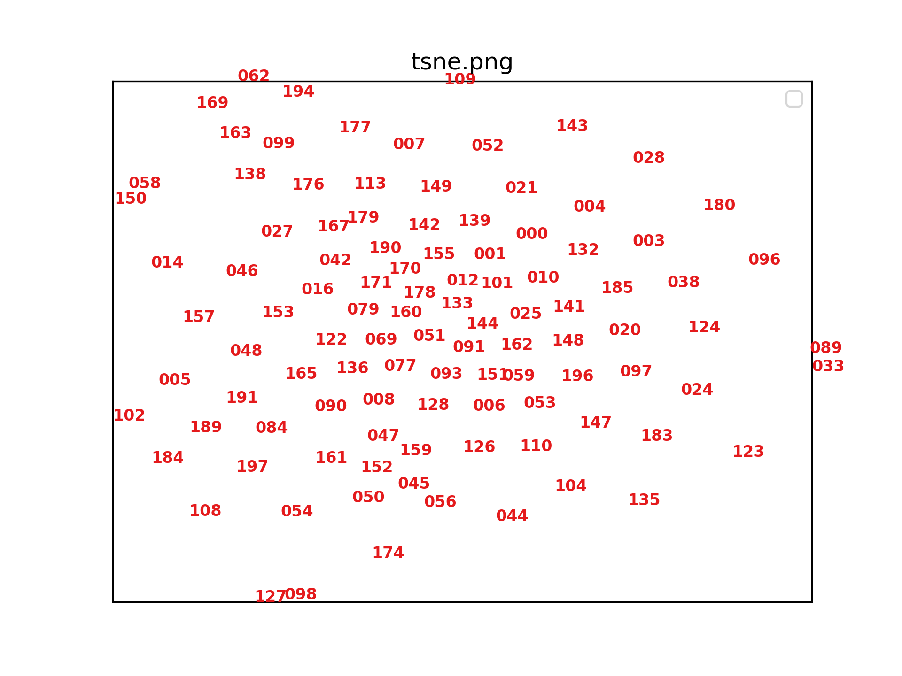

# data-crawling-filter


**运行环境**

+ Ubuntu 16.04
+ Python 3.7.9
+ Pytorch: 1.4.0
+ torchvision: 0.5.0
+ CUDA: 10.0

**依赖库**

+ umap-learn == 0.5.2
+ numpy <= 1.20
+ matplotlib == 3.3.4
+ opencv-python 4.5.1.48

依赖库安装

```pip install -r requirements.txt```

**任务报告**
+ **任务目标**
 爬取人脸图片

+ **数据源**
百度

+ **爬取方式**
[Image-Downloader](https://github.com/sczhengyabin/Image-Downloader) 

+ **数据观察结果**
  + 包含需要的图片
  + 同时包含人脸相关的非真实人脸图片
  + 包含与人脸完全不相关的图片
  
  
  
+ **筛选目标**
  + 剔除一张图中包含很多人脸的图片
  + 剔除人脸模型的图片
  + 剔除虚拟及卡通人脸
  + 剔除有遮挡的人脸
  + 剔除采集设备中较小的人脸
  + 剔除与人脸毫不相关的图片
  
  
  
  
+ **数据筛选**
  + **数据加载**
  
  运行相应的三文件的root_dir和file_suffix参数
 + **运行**
   + **初级筛选**
   + ```python img_primary_filter.py```
    ```
   33  root_dir = "../../Image-Downloader-master/download_images/face_"
   34  file_suffix = "jpeg|jpg|png"
   35  remove_dir = root_dir + "/remove"
   ```
   
   
   
   + **高级数据筛选**
   ```python img_advanced_filter.py```
   ```
    97  root_dir = "./face_"
    98  # check dir
    99  file_suffix = "jpeg|jpg|png"
    100 remove_dir = root_dir + "/remove"
    ```
   + 筛选结果
     umap的点明显更聚集，可通过umap的点辅助筛选，以真实人脸为基点向周围查找提高筛选效率
     
     
     
     
    + 示例，0类聚集都为相似的表情包
     
   
  

